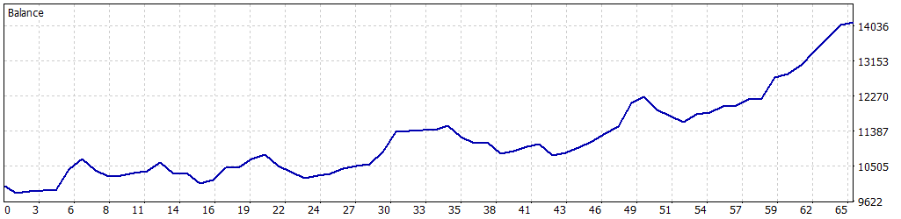

# 📈 Simulación Optimizada: 01-01-2025 a 17-05-2025

Esta simulación fue realizada para el Expert Advisor **Back to the Range** en MetaTrader 5, utilizando datos históricos del índice **US30.cash** desde el **1 de enero de 2025** hasta el **17 de mayo de 2025**. Los parámetros fueron optimizados para maximizar el rendimiento mientras se controla el riesgo, logrando un equilibrio entre rentabilidad y estabilidad en un entorno de trading de índices.

---

## ⚙️ Configuración de la Simulación

- **Informe del Probador de Estrategias**: FTMO-Server5 (Build 4755)
- **Experto**: Back to the Range
- **Símbolo**: US30.cash
- **Período**: H1 (2025.01.01 - 2025.05.17)
- **Empresa**: FTMO Global Markets Ltd
- **Divisa**: USD
- **Depósito inicial**: 10,000.00 USD
- **Apalancamiento**: 1:30

### Parámetros de Entrada

| Parámetro                         | Descripción                                                  | Valor Utilizado   |
|-----------------------------------|--------------------------------------------------------------|-------------------|
| `HORA_INICIO_RECOGIDA`            | Hora de inicio para recolección de datos (GMT)               | 7                 |
| `HORA_FINAL_RECOGIDA`             | Hora de fin para recolección de datos (GMT)                  | 14                |
| `HORA_INICIO_OPERACIONES`         | Hora de inicio para operaciones (GMT)                        | 16                |
| `HORA_FINAL_OPERACIONES`          | Hora de fin para operaciones (GMT)                           | 21                |
| `LOTE_FIJO`                       | Tamaño de lote inicial                                       | 2.0               |
| `USAR_MULTIPLICADOR`              | Activar multiplicador de lotes tras ganancia                 | true              |
| `MULTIPLICADOR_LOTES`             | Multiplicador en rachas ganadoras                            | 1.7               |
| `LOTE_MAXIMO`                     | Tamaño máximo del contrato                                   | 3.4               |
| `PUNTOS_SL`                       | Stop Loss en puntos                                          | 8000              |
| `PUNTOS_TP`                       | Take Profit en puntos                                        | 15000             |
| `USAR_TRAILING_STOP`              | Activar/desactivar trailing stop                             | true              |
| `PUNTOS_ACTIVACION_TRAILING`      | Puntos para activar trailing stop                            | 4000              |
| `PASO_TRAILING_STOP`              | Paso del trailing stop en puntos                             | 4000              |
| `USAR_BREAK_EVEN`                 | Activar/desactivar break even                                | false             |
| `PUNTOS_ACTIVACION_BREAK_EVEN`    | Puntos para activar break even                               | 11000             |
| `USAR_OBJETIVO_SALDO`             | Activar objetivo de saldo                                    | false             |
| `OBJETIVO_SALDO`                  | Objetivo de saldo para cerrar el bot (USD)                   | 11000.0           |
| `SALDO_MINIMO_OPERATIVO`          | Saldo mínimo para operar (USD)                               | 9050.0            |
| `PERDIDA_DIARIA_MAXIMA`           | Pérdida diaria máxima permitida (USD)                        | 500.0             |
| `FACTOR_CINTURON_SEGURIDAD`       | Factor de seguridad para pérdida diaria (0.0 a 1.0)          | 0.5               |
| `COLOR_RECTANGULO`                | Color del rectángulo de rango                                | clrWhite          |
| `COLOR_LINEAS`                    | Color de las líneas de tiempo                                | clrRed            |

---

## 📊 Resultados de la Simulación

### Resumen General

| Métrica                          | Valor              |
|----------------------------------|--------------------|
| **Calidad del historial**        | 100% (ticks reales) |
| **Barras**                       | 2,193             |
| **Ticks**                        | 12,113,649        |
| **Símbolos**                     | 1                 |
| **Beneficio Neto**               | 4,135.37 USD      |
| **Beneficio Bruto**              | 7,544.49 USD      |
| **Pérdidas Brutas**              | -3,409.12 USD     |
| **Factor de Beneficio**          | 2.21              |
| **Beneficio Esperado**           | 63.62 USD         |
| **Factor de Recuperación**       | 4.96              |
| **Ratio de Sharpe**              | 30.18             |
| **Z-Score**                      | -1.57 (88.12%)    |
| **AHPR**                         | 1.0055 (0.55%)    |
| **GHPR**                         | 1.0053 (0.53%)    |
| **Reducción absoluta del balance** | 163.16 USD      |
| **Reducción absoluta de la equidad** | 168.52 USD    |
| **Reducción máxima del balance** | 733.75 USD (6.37%) |
| **Reducción máxima de la equidad** | 833.31 USD (7.19%) |
| **Reducción relativa del balance** | 6.37% (733.75 USD) |
| **Reducción relativa de la equidad** | 7.19% (833.31 USD) |
| **Nivel de margen**              | 100.33%           |
| **LR Correlation**               | 0.88              |
| **LR Standard Error**            | 484.19            |
| **Resultado de OnTester**        | 0                 |

### Estadísticas de Operaciones

| Métrica                                   | Valor              |
|-------------------------------------------|--------------------|
| **Total de operaciones ejecutadas**       | 65                |
| **Total de transacciones**                | 130               |
| **Posiciones rentables (% del total)**    | 49 (75.38%)       |
| **Posiciones no rentables (% del total)** | 16 (24.62%)       |
| **Posiciones cortas (% rentables)**       | 33 (78.79%)       |
| **Posiciones largas (% rentables)**       | 32 (71.88%)       |
| **Transacción rentable promedio**         | 153.97 USD        |
| **Transacción no rentable promedio**      | -213.07 USD       |
| **Transacción rentable máxima**           | 594.35 USD        |
| **Transacción no rentable máxima**        | -326.33 USD       |
| **Máximo de ganancias consecutivas**      | 13 (2,525.32 USD) |
| **Máximo de pérdidas consecutivas**       | 3 (-653.45 USD)   |
| **Máximo de beneficio consecutivo**       | 2,525.32 USD (13) |
| **Máximo de pérdidas consecutivas**       | -653.45 USD (3)   |
| **Promedio de ganancias consecutivas**    | 5                 |
| **Promedio de pérdidas consecutivas**     | 2                 |

---

## 📉 Gráfico de Rendimiento

---

## ⚠️ Notas y Advertencia

- Esta simulación se realizó con datos históricos de alta calidad (100% ticks reales) para el período de aproximadamente cinco meses (01-01-2025 a 17-05-2025).
- **Advertencia**: Los resultados reflejan un período específico de prueba, lo que podría no capturar todas las condiciones futuras del mercado. La estrategia de **Back to the Range**, basada en el retorno al rango con multiplicador de lotes, puede ser sensible a cambios en la volatilidad o movimientos direccionales fuertes en el índice US30. Se recomienda realizar pruebas adicionales en períodos más amplios o en condiciones de mercado en vivo para validar la robustez de la estrategia.
- **Gestión de riesgos**: Los parámetros como `PERDIDA_DIARIA_MAXIMA` y `FACTOR_CINTURON_SEGURIDAD` están diseñados para cumplir con las reglas de FTMO, asegurando una operativa segura. El uso del multiplicador de lotes (`MULTIPLICADOR_LOTES`) requiere una monitorización cuidadosa para evitar una exposición excesiva.
- **Recomendaciones**:
  - Prueba el EA en una cuenta demo antes de operarlo en vivo.
  - Evita operar durante noticias de alto impacto (e.g., datos de empleo de EE.UU., decisiones de la Fed), ya que el EA no incluye un filtro automático de noticias.
  - Considera optimizar los parámetros para otros índices soportados (e.g., US500, US100) o temporalidades si planeas usar el EA fuera de US30 en H1.