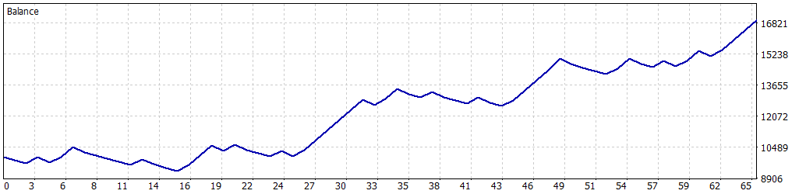

# 📈 Simulación Optimizada: 01-01-2025 a 17-05-2025

Esta simulación fue realizada para el Expert Advisor **Back to the Range** en MetaTrader 5, utilizando datos históricos del índice **US30.cash** desde el **1 de enero de 2025** hasta el **17 de mayo de 2025**. Los parámetros fueron configurados para operar en un entorno de trading de índices, buscando un equilibrio entre rentabilidad y control de riesgo mediante una estrategia de retorno al rango.

---

## ⚙️ Configuración de la Simulación

- **Informe del Probador de Estrategias**: FTMO-Server5 (Build 4755)
- **Experto**: Back to the Range
- **Símbolo**: US30.cash
- **Período**: H1 (2025.01.01 - 2025.05.17)
- **Empresa**: FTMO Global Markets Ltd
- **Divisa**: USD
- **Depósito inicial**: 10,000.00 USD
- **Apalancamiento**: 1:30

### Parámetros de Entrada

| Parámetro                         | Descripción                                                  | Valor Utilizado   |
|-----------------------------------|--------------------------------------------------------------|-------------------|
| `HORA_INICIO_RECOGIDA`            | Hora de inicio para recolección de datos (GMT)               | 7                 |
| `HORA_FINAL_RECOGIDA`             | Hora de fin para recolección de datos (GMT)                  | 14                |
| `HORA_INICIO_OPERACIONES`         | Hora de inicio para operaciones (GMT)                        | 16                |
| `HORA_FINAL_OPERACIONES`          | Hora de fin para operaciones (GMT)                           | 21                |
| `LOTE_FIJO`                       | Tamaño de lote inicial                                       | 2.0               |
| `USAR_MULTIPLICADOR`              | Activar multiplicador de lotes tras ganancia                 | true              |
| `MULTIPLICADOR_LOTES`             | Multiplicador en rachas ganadoras                            | 1.7               |
| `LOTE_MAXIMO`                     | Tamaño máximo del contrato                                   | 3.4               |
| `PUNTOS_SL`                       | Stop Loss en puntos                                          | 8000              |
| `PUNTOS_TP`                       | Take Profit en puntos                                        | 15000             |
| `USAR_TRAILING_STOP`              | Activar/desactivar trailing stop                             | false             |
| `PUNTOS_ACTIVACION_TRAILING`      | Puntos para activar trailing stop                            | 4000              |
| `PASO_TRAILING_STOP`              | Paso del trailing stop en puntos                             | 4000              |
| `USAR_BREAK_EVEN`                 | Activar/desactivar break even                                | false             |
| `PUNTOS_ACTIVACION_BREAK_EVEN`    | Puntos para activar break even                               | 11000             |
| `USAR_OBJETIVO_SALDO`             | Activar objetivo de saldo                                    | false             |
| `OBJETIVO_SALDO`                  | Objetivo de saldo para cerrar el bot (USD)                   | 11000.0           |
| `SALDO_MINIMO_OPERATIVO`          | Saldo mínimo para operar (USD)                               | 9050.0            |
| `PERDIDA_DIARIA_MAXIMA`           | Pérdida diaria máxima permitida (USD)                        | 500.0             |
| `FACTOR_CINTURON_SEGURIDAD`       | Factor de seguridad para pérdida diaria (0.0 a 1.0)          | 0.5               |
| `COLOR_RECTANGULO`                | Color del rectángulo de rango                                | clrWhite          |
| `COLOR_LINEAS`                    | Color de las líneas de tiempo                                | clrRed            |

---

## 📊 Resultados de la Simulación

### Resumen General

| Métrica                          | Valor              |
|----------------------------------|--------------------|
| **Calidad del historial**        | 100% (ticks reales) |
| **Barras**                       | 2,193             |
| **Ticks**                        | 12,113,649        |
| **Símbolos**                     | 1                 |
| **Beneficio Neto**               | 7,000.12 USD      |
| **Beneficio Bruto**              | 13,836.57 USD     |
| **Pérdidas Brutas**              | -6,836.45 USD     |
| **Factor de Beneficio**          | 2.02              |
| **Beneficio Esperado**           | 107.69 USD        |
| **Factor de Recuperación**       | 5.54              |
| **Ratio de Sharpe**              | 20.08             |
| **Z-Score**                      | -0.75 (54.67%)    |
| **AHPR**                         | 1.0086 (0.86%)    |
| **GHPR**                         | 1.0082 (0.82%)    |
| **Reducción absoluta del balance** | 708.69 USD      |
| **Reducción absoluta de la equidad** | 716.25 USD    |
| **Reducción máxima del balance** | 1,221.89 USD (11.62%) |
| **Reducción máxima de la equidad** | 1,262.77 USD (11.97%) |
| **Reducción relativa del balance** | 11.62% (1,221.89 USD) |
| **Reducción relativa de la equidad** | 11.97% (1,262.77 USD) |
| **Nivel de margen**              | 97.96%            |
| **LR Correlation**               | 0.95              |
| **LR Standard Error**            | 667.62            |
| **Resultado de OnTester**        | 0                 |

### Estadísticas de Operaciones

| Métrica                                   | Valor              |
|-------------------------------------------|--------------------|
| **Total de operaciones ejecutadas**       | 65                |
| **Total de transacciones**                | 130               |
| **Posiciones rentables (% del total)**    | 33 (50.77%)       |
| **Posiciones no rentables (% del total)** | 32 (49.23%)       |
| **Posiciones cortas (% rentables)**       | 33 (45.45%)       |
| **Posiciones largas (% rentables)**       | 32 (56.25%)       |
| **Transacción rentable promedio**         | 419.29 USD        |
| **Transacción no rentable promedio**      | -213.64 USD       |
| **Transacción rentable máxima**           | 594.35 USD        |
| **Transacción no rentable máxima**        | -300.83 USD       |
| **Máximo de ganancias consecutivas**      | 6 (2,901.45 USD)  |
| **Máximo de pérdidas consecutivas**       | 5 (-930.63 USD)   |
| **Máximo de beneficio consecutivo**       | 2,901.45 USD (6)  |
| **Máximo de pérdidas consecutivas**       | -930.63 USD (5)   |
| **Promedio de ganancias consecutivas**    | 2                 |
| **Promedio de pérdidas consecutivas**     | 2                 |

---

## 📉 Gráfico de Rendimiento

---

## ⚠️ Notas y Advertencia

- Esta simulación se realizó con datos históricos de alta calidad (100% ticks reales) para el período de aproximadamente cinco meses (01-01-2025 a 17-05-2025).
- **Advertencia**: Los resultados reflejan un período específico de prueba, lo que podría no capturar todas las condiciones futuras del mercado. La estrategia de **Back to the Range**, basada en el retorno al rango con multiplicador de lotes, muestra una mayor drawdown (11.97% en equidad) en comparación con configuraciones que incluyen trailing stop, lo que indica una exposición al riesgo más alta. Se recomienda realizar pruebas adicionales en períodos más amplios o en condiciones de mercado en vivo para validar la robustez de la estrategia.
- **Gestión de riesgos**: Los parámetros como `PERDIDA_DIARIA_MAXIMA` y `FACTOR_CINTURON_SEGURIDAD` están diseñados para cumplir con las reglas de FTMO, asegurando una operativa segura. Sin embargo, la desactivación de `USAR_TRAILING_STOP` y `USAR_BREAK_EVEN` aumenta la dependencia en los niveles de Stop Loss y Take Profit, lo que puede amplificar las pérdidas en movimientos adversos.
- **Recomendaciones**:
  - Prueba el EA en una cuenta demo antes de operarlo en vivo.
  - Considera activar `USAR_TRAILING_STOP` o `USAR_BREAK_EVEN` para reducir el riesgo en operaciones prolongadas.
  - Evita operar durante noticias de alto impacto (e.g., datos de empleo de EE.UU., decisiones de la Fed), ya que el EA no incluye un filtro automático de noticias.
  - Evalúa la optimización de parámetros para otros índices soportados (e.g., US500, US100) o temporalidades si planeas usar el EA fuera de US30 en H1.