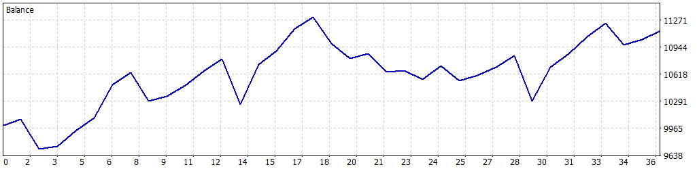

# 📈 Simulación Optimizada: 01-02-2025 a 28-02-2025

Esta simulación fue realizada para el Expert Advisor **FusRoDah! v03** en MetaTrader 5, utilizando datos históricos del índice **US100.cash** desde el **1 de febrero de 2025** hasta el **28 de febrero de 2025**. Los parámetros fueron optimizados para maximizar el rendimiento mientras se controla el riesgo, con un enfoque en permitir múltiples operaciones simultáneas para una estrategia más agresiva, manteniendo un equilibrio entre rentabilidad y estabilidad.

---

## ⚙️ Configuración de la Simulación

- **Informe del Probador de Estrategias**: FTMO-Server5 (Build 4755)
- **Experto**: FusRoDah! v03
- **Símbolo**: US100.cash
- **Período**: H1 (2025.02.01 - 2025.02.28)
- **Empresa**: FTMO Global Markets Ltd
- **Divisa**: USD
- **Depósito inicial**: 10,000.00 USD
- **Apalancamiento**: 1:30

### Parámetros de Entrada

| Parámetro                   | Descripción                                               | Valor Utilizado   |
|-----------------------------|-----------------------------------------------------------|-------------------|
| `LOTE_FIJO`                 | Lote fijo inicial para las operaciones                    | 1.0               |
| `USAR_MULTIPLICADOR`        | Activar/desactivar multiplicador de lotes para rachas ganadoras | true              |
| `MULTIPLICADOR_LOTES`       | Multiplicador de lotes para rachas ganadoras              | 2.0               |
| `LOTE_MAXIMO`               | Lote máximo permitido con el multiplicador                | 3.0               |
| `PERIODO`                   | Periodo del gráfico (solo H1 o M30 permitido)             | PERIOD_H1 (1 Hour)|
| `COLOR_RECTANGULO`          | Color del rectángulo dibujado en el gráfico               | clrBlue (16711680)|
| `HORA_INICIAL_RANGO1`       | Hora inicial del Rango 1 (UTC+3)                          | 3.0               |
| `HORA_FINAL_RANGO1`         | Hora final del Rango 1 (UTC+3)                            | 9.0               |
| `HORA_INICIAL_RANGO2`       | Hora inicial del Rango 2 (UTC+3)                          | 14.0              |
| `HORA_FINAL_RANGO2`         | Hora final del Rango 2 (UTC+3)                            | 17.0              |
| `PUNTOS_SL`                 | Stop Loss en puntos gráficos                              | 18000             |
| `PUNTOS_TP`                 | Take Profit en puntos gráficos                            | 16000             |
| `HORAS_EXPIRACION`          | Horas de expiración de órdenes pendientes                 | 6                 |
| `USAR_TRAILING_STOP`        | Activar/desactivar Trailing Stop                         | true              |
| `PUNTOS_ACTIVACION_TRAILING`| Puntos de beneficio para activar trailing stop            | 6000              |
| `PASO_TRAILING_STOP`        | Paso en puntos para ajustar el trailing stop              | 1500              |
| `PERMITIR_OPERACIONES_MULTIPLES` | Permitir múltiples operaciones simultáneas           | true              |
| `MAX_POSICIONES`            | Número máximo de posiciones abiertas simultáneamente     | 4                 |
| `USAR_OBJETIVO_SALDO`       | Activar/desactivar objetivo de saldo                      | false             |
| `OBJETIVO_SALDO`            | Saldo objetivo para cerrar el bot (USD)                   | 11000.0           |
| `SALDO_MINIMO_OPERATIVO`    | Saldo mínimo operativo (USD)                              | 9050.0            |
| `PERDIDA_DIARIA_MAXIMA`     | Pérdida diaria máxima permitida (USD)                     | 500.0             |
| `FACTOR_CINTURON_SEGURIDAD` | Multiplicador de seguridad sobre la pérdida máxima diaria | 0.5               |

---

## 📊 Resultados de la Simulación

### Resumen General

| Métrica                          | Valor              |
|----------------------------------|--------------------|
| **Calidad del historial**        | 100%              |
| **Barras**                       | 433               |
| **Ticks**                        | 3,691,538         |
| **Símbolos**                     | 1                 |
| **Beneficio Neto**               | 1,141.16 USD      |
| **Beneficio Bruto**              | 4,196.51 USD      |
| **Pérdidas Brutas**              | -3,055.35 USD     |
| **Factor de Beneficio**          | 1.37              |
| **Beneficio Esperado**           | 31.70 USD         |
| **Factor de Recuperación**       | 1.53              |
| **Ratio de Sharpe**              | 7.63              |
| **Z-Score**                      | 1.72 (91.46%)     |
| **AHPR**                         | 1.0033 (0.33%)    |
| **GHPR**                         | 1.0030 (0.30%)    |
| **Reducción absoluta del balance** | 282.11 USD      |
| **Reducción absoluta de la equidad** | 260.27 USD    |
| **Reducción máxima del balance** | 1,008.94 USD (8.92%) |
| **Reducción máxima de la equidad** | 746.88 USD (6.65%) |
| **Reducción relativa del balance** | 8.92% (1,008.94 USD) |
| **Reducción relativa de la equidad** | 6.65% (746.88 USD) |
| **Nivel de margen**              | 118.70%           |
| **LR Correlation**               | 0.71              |
| **LR Standard Error**            | 289.82            |
| **Resultado de OnTester**        | 0                 |

### Estadísticas de Operaciones

| Métrica                                   | Valor              |
|-------------------------------------------|--------------------|
| **Total de operaciones ejecutadas**       | 36                |
| **Total de transacciones**                | 72                |
| **Posiciones rentables (% del total)**    | 26 (72.22%)       |
| **Posiciones no rentables (% del total)** | 10 (27.78%)       |
| **Posiciones cortas (% rentables)**       | 19 (68.42%)       |
| **Posiciones largas (% rentables)**       | 17 (76.47%)       |
| **Transacción rentable promedio**         | 161.40 USD        |
| **Transacción no rentable promedio**      | -305.54 USD       |
| **Transacción rentable máxima**           | 484.14 USD        |
| **Transacción no rentable máxima**        | -544.92 USD       |
| **Máximo de ganancias consecutivas**      | 5 (924.27 USD)    |
| **Máximo de pérdidas consecutivas**       | 2 (-497.53 USD)   |
| **Máximo de beneficio consecutivo**       | 1,054.54 USD (4)  |
| **Máximo de pérdidas consecutivas**       | -544.92 USD (1)   |
| **Promedio de ganancias consecutivas**    | 3                 |
| **Promedio de pérdidas consecutivas**     | 1                 |

---

## 📉 Gráfico de Rendimiento

---

## ⚠️ Notas y Advertencia

- Esta simulación se realizó después de un proceso de optimización de parámetros, incluyendo la activación de `PERMITIR_OPERACIONES_MULTIPLES=true` y `MAX_POSICIONES=4`, lo que permite una estrategia más agresiva al abrir múltiples operaciones simultáneas.
- **Advertencia**: Aunque la optimización mejora el rendimiento, al estar concentrada en un período de apenas un mes (01-02-2025 a 28-02-2025), puede haber cierta **sobreoptimización**. La estrategia con múltiples operaciones simultáneas aumenta el riesgo de exposición, especialmente en mercados volátiles. Se recomienda realizar pruebas adicionales en períodos más amplios o en condiciones de mercado en vivo para validar la robustez de la estrategia.
- **Gestión de riesgos**: Asegúrese de ajustar parámetros como `LOTE_FIJO`, `PERDIDA_DIARIA_MAXIMA`, `SALDO_MINIMO_OPERATIVO`, y `MAX_POSICIONES` según el tamaño de su cuenta y tolerancia al riesgo, especialmente con múltiples operaciones activas.