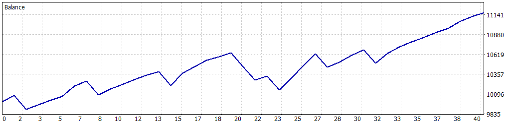

# 📈 Simulación Optimizada: 01-02-2025 a 28-02-2025

Esta simulación fue realizada para el Expert Advisor **FusRoDah! v03** en MetaTrader 5, utilizando datos históricos del índice **US100.cash** desde el **1 de febrero de 2025** hasta el **28 de febrero de 2025**. Los parámetros fueron configurados para mantener un equilibrio entre rentabilidad y control de riesgo, permitiendo múltiples operaciones simultáneas para una estrategia dinámica, con un enfoque en la estabilidad mediante trailing stop y límites estrictos de pérdida diaria.

---

## ⚙️ Configuración de la Simulación

- **Informe del Probador de Estrategias**: FTMO-Server5 (Build 4755)
- **Experto**: FusRoDah! v03
- **Símbolo**: US100.cash
- **Período**: H1 (2025.02.01 - 2025.02.28)
- **Empresa**: FTMO Global Markets Ltd
- **Divisa**: USD
- **Depósito inicial**: 10,000.00 USD
- **Apalancamiento**: 1:30

### Parámetros de Entrada

| Parámetro                   | Descripción                                               | Valor Utilizado   |
|-----------------------------|-----------------------------------------------------------|-------------------|
| `LOTE_FIJO`                 | Lote fijo inicial para las operaciones                    | 1.0               |
| `USAR_MULTIPLICADOR`        | Activar/desactivar multiplicador de lotes para rachas ganadoras | false             |
| `MULTIPLICADOR_LOTES`       | Multiplicador de lotes para rachas ganadoras              | 2.0               |
| `LOTE_MAXIMO`               | Lote máximo permitido con el multiplicador                | 3.0               |
| `PERIODO`                   | Periodo del gráfico (solo H1 o M30 permitido)             | PERIOD_H1 (1 Hour)|
| `COLOR_RECTANGULO`          | Color del rectángulo dibujado en el gráfico               | clrBlue (16711680)|
| `HORA_INICIAL_RANGO1`       | Hora inicial del Rango 1 (UTC+3)                          | 3.0               |
| `HORA_FINAL_RANGO1`         | Hora final del Rango 1 (UTC+3)                            | 9.0               |
| `HORA_INICIAL_RANGO2`       | Hora inicial del Rango 2 (UTC+3)                          | 14.0              |
| `HORA_FINAL_RANGO2`         | Hora final del Rango 2 (UTC+3)                            | 17.0              |
| `PUNTOS_SL`                 | Stop Loss en puntos gráficos                              | 18000             |
| `PUNTOS_TP`                 | Take Profit en puntos gráficos                            | 16000             |
| `HORAS_EXPIRACION`          | Horas de expiración de órdenes pendientes                 | 6                 |
| `USAR_TRAILING_STOP`        | Activar/desactivar Trailing Stop                         | true              |
| `PUNTOS_ACTIVACION_TRAILING`| Puntos de beneficio para activar trailing stop            | 6000              |
| `PASO_TRAILING_STOP`        | Paso en puntos para ajustar el trailing stop              | 1500              |
| `PERMITIR_OPERACIONES_MULTIPLES` | Permitir múltiples operaciones simultáneas           | true              |
| `MAX_POSICIONES`            | Número máximo de posiciones abiertas simultáneamente     | 4                 |
| `USAR_OBJETIVO_SALDO`       | Activar/desactivar objetivo de saldo                      | false             |
| `OBJETIVO_SALDO`            | Saldo objetivo para cerrar el bot (USD)                   | 11000.0           |
| `SALDO_MINIMO_OPERATIVO`    | Saldo mínimo operativo (USD)                              | 9200.0            |
| `PERDIDA_DIARIA_MAXIMA`     | Pérdida diaria máxima permitida (USD)                     | 500.0             |
| `FACTOR_CINTURON_SEGURIDAD` | Multiplicador de seguridad sobre la pérdida máxima diaria | 0.5               |

---

## 📊 Resultados de la Simulación

### Resumen General

| Métrica                          | Valor              |
|----------------------------------|--------------------|
| **Calidad del historial**        | 100%              |
| **Barras**                       | 433               |
| **Ticks**                        | 3,691,538         |
| **Símbolos**                     | 1                 |
| **Beneficio Neto**               | 1,170.89 USD      |
| **Beneficio Bruto**              | 2,617.80 USD      |
| **Pérdidas Brutas**              | -1,446.91 USD     |
| **Factor de Beneficio**          | 1.81              |
| **Beneficio Esperado**           | 29.27 USD         |
| **Factor de Recuperación**       | 2.40              |
| **Ratio de Sharpe**              | 9.98              |
| **Z-Score**                      | 0.86 (61.02%)     |
| **AHPR**                         | 1.0028 (0.28%)    |
| **GHPR**                         | 1.0028 (0.28%)    |
| **Reducción absoluta del balance** | 101.72 USD      |
| **Reducción absoluta de la equidad** | 134.74 USD    |
| **Reducción máxima del balance** | 491.40 USD (4.62%) |
| **Reducción máxima de la equidad** | 487.46 USD (4.61%) |
| **Reducción relativa del balance** | 4.62% (491.40 USD) |
| **Reducción relativa de la equidad** | 4.61% (487.46 USD) |
| **Nivel de margen**              | 171.22%           |
| **LR Correlation**               | 0.91              |
| **LR Standard Error**            | 137.93            |
| **Resultado de OnTester**        | 0                 |

### Estadísticas de Operaciones

| Métrica                                   | Valor              |
|-------------------------------------------|--------------------|
| **Total de operaciones ejecutadas**       | 40                |
| **Total de transacciones**                | 80                |
| **Posiciones rentables (% del total)**    | 32 (80.00%)       |
| **Posiciones no rentables (% del total)** | 8 (20.00%)        |
| **Posiciones cortas (% rentables)**       | 21 (80.95%)       |
| **Posiciones largas (% rentables)**       | 19 (78.95%)       |
| **Transacción rentable promedio**         | 81.81 USD         |
| **Transacción no rentable promedio**      | -180.86 USD       |
| **Transacción rentable máxima**           | 161.38 USD        |
| **Transacción no rentable máxima**        | -184.01 USD       |
| **Máximo de ganancias consecutivas**      | 9 (669.59 USD)    |
| **Máximo de pérdidas consecutivas**       | 2 (-360.36 USD)   |
| **Máximo de beneficio consecutivo**       | 669.59 USD (9)    |
| **Máximo de pérdidas consecutivas**       | -360.36 USD (2)   |
| **Promedio de ganancias consecutivas**    | 4                 |
| **Promedio de pérdidas consecutivas**     | 1                 |

---

## 📉 Gráfico de Rendimiento

---

## ⚠️ Notas y Advertencia

- Esta simulación utiliza `PERMITIR_OPERACIONES_MULTIPLES=true` y `MAX_POSICIONES=4`, permitiendo hasta cuatro operaciones simultáneas para una estrategia más agresiva. Sin embargo, `USAR_MULTIPLICADOR=false` asegura un tamaño de lote fijo, reduciendo la exposición al riesgo en comparación con una estrategia de multiplicador activado.
- **Advertencia**: Los resultados corresponden a un período de un mes (01-02-2025 a 28-02-2025), lo que podría limitar su representatividad debido a condiciones específicas del mercado. Esto aumenta el riesgo de **sobreoptimización**. Se recomienda realizar pruebas en períodos más extensos o en condiciones de mercado en vivo para validar la robustez de la estrategia.
- **Gestión de riesgos**: Ajuste parámetros como `LOTE_FIJO`, `PERDIDA_DIARIA_MAXIMA`, `SALDO_MINIMO_OPERATIVO`, y `MAX_POSICIONES` según el tamaño de su cuenta y tolerancia al riesgo. La configuración de múltiples operaciones simultáneas incrementa la exposición, especialmente en mercados volátiles.