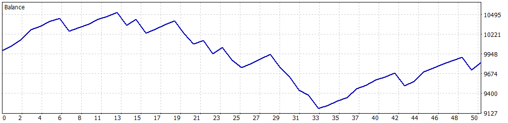

# 📈 Simulación: 01-03-2025 a 31-03-2025

Esta simulación fue realizada para el Expert Advisor **FusRoDah! v03** en MetaTrader 5, utilizando datos históricos del índice **US100.cash** desde el **1 de marzo de 2025** hasta el **31 de marzo de 2025**. Los parámetros fueron configurados para permitir múltiples operaciones simultáneas, manteniendo un enfoque en la gestión de riesgos mediante trailing stop y límites de pérdida diaria. Sin embargo, los resultados muestran una pérdida neta, lo que sugiere que las condiciones del mercado en este período no fueron favorables para la estrategia implementada.

---

## ⚙️ Configuración de la Simulación

- **Informe del Probador de Estrategias**: FTMO-Server5 (Build 4755)
- **Experto**: FusRoDah! v03
- **Símbolo**: US100.cash
- **Período**: H1 (2025.03.01 - 2025.03.31)
- **Empresa**: FTMO Global Markets Ltd
- **Divisa**: USD
- **Depósito inicial**: 10,000.00 USD
- **Apalancamiento**: 1:30

### Parámetros de Entrada

| Parámetro                   | Descripción                                               | Valor Utilizado   |
|-----------------------------|-----------------------------------------------------------|-------------------|
| `LOTE_FIJO`                 | Lote fijo inicial para las operaciones                    | 1.0               |
| `USAR_MULTIPLICADOR`        | Activar/desactivar multiplicador de lotes para rachas ganadoras | false             |
| `MULTIPLICADOR_LOTES`       | Multiplicador de lotes para rachas ganadoras              | 2.0               |
| `LOTE_MAXIMO`               | Lote máximo permitido con el multiplicador                | 3.0               |
| `PERIODO`                   | Periodo del gráfico (solo H1 o M30 permitido)             | PERIOD_H1 (1 Hour)|
| `COLOR_RECTANGULO`          | Color del rectángulo dibujado en el gráfico               | clrBlue (16711680)|
| `HORA_INICIAL_RANGO1`       | Hora inicial del Rango 1 (UTC+3)                          | 3.0               |
| `HORA_FINAL_RANGO1`         | Hora final del Rango 1 (UTC+3)                            | 9.0               |
| `HORA_INICIAL_RANGO2`       | Hora inicial del Rango 2 (UTC+3)                          | 14.0              |
| `HORA_FINAL_RANGO2`         | Hora final del Rango 2 (UTC+3)                            | 17.0              |
| `PUNTOS_SL`                 | Stop Loss en puntos gráficos                              | 18000             |
| `PUNTOS_TP`                 | Take Profit en puntos gráficos                            | 16000             |
| `HORAS_EXPIRACION`          | Horas de expiración de órdenes pendientes                 | 6                 |
| `USAR_TRAILING_STOP`        | Activar/desactivar Trailing Stop                         | true              |
| `PUNTOS_ACTIVACION_TRAILING`| Puntos de beneficio para activar trailing stop            | 6000              |
| `PASO_TRAILING_STOP`        | Paso en puntos para ajustar el trailing stop              | 1500              |
| `PERMITIR_OPERACIONES_MULTIPLES` | Permitir múltiples operaciones simultáneas           | true              |
| `MAX_POSICIONES`            | Número máximo de posiciones abiertas simultáneamente     | 4                 |
| `USAR_OBJETIVO_SALDO`       | Activar/desactivar objetivo de saldo                      | false             |
| `OBJETIVO_SALDO`            | Saldo objetivo para cerrar el bot (USD)                   | 11000.0           |
| `SALDO_MINIMO_OPERATIVO`    | Saldo mínimo operativo (USD)                              | 9200.0            |
| `PERDIDA_DIARIA_MAXIMA`     | Pérdida diaria máxima permitida (USD)                     | 500.0             |
| `FACTOR_CINTURON_SEGURIDAD` | Multiplicador de seguridad sobre la pérdida máxima diaria | 0.5               |

---

## 📊 Resultados de la Simulación

### Resumen General

| Métrica                          | Valor              |
|----------------------------------|--------------------|
| **Calidad del historial**        | 100%              |
| **Barras**                       | 460               |
| **Ticks**                        | 4,821,679         |
| **Símbolos**                     | 1                 |
| **Beneficio Neto**               | -163.25 USD       |
| **Beneficio Bruto**              | 2,285.81 USD      |
| **Pérdidas Brutas**              | -2,449.06 USD     |
| **Factor de Beneficio**          | 0.93              |
| **Beneficio Esperado**           | -3.26 USD         |
| **Factor de Recuperación**       | -0.13             |
| **Ratio de Sharpe**              | -1.62             |
| **Z-Score**                      | -0.85 (60.47%)    |
| **AHPR**                         | 0.9997 (-0.03%)   |
| **GHPR**                         | 0.9997 (-0.03%)   |
| **Reducción absoluta del balance** | 806.83 USD      |
| **Reducción absoluta de la equidad** | 766.65 USD    |
| **Reducción máxima del balance** | 1,332.69 USD (12.66%) |
| **Reducción máxima de la equidad** | 1,264.64 USD (12.05%) |
| **Reducción relativa del balance** | 12.66% (1,332.69 USD) |
| **Reducción relativa de la equidad** | 12.05% (1,264.64 USD) |
| **Nivel de margen**              | 354.01%           |
| **LR Correlation**               | -0.74             |
| **LR Standard Error**            | 253.61            |
| **Resultado de OnTester**        | 0                 |

### Estadísticas de Operaciones

| Métrica                                   | Valor              |
|-------------------------------------------|--------------------|
| **Total de operaciones ejecutadas**       | 50                |
| **Total de transacciones**                | 100               |
| **Posiciones rentables (% del total)**    | 35 (70.00%)       |
| **Posiciones no rentables (% del total)** | 15 (30.00%)       |
| **Posiciones cortas (% rentables)**       | 27 (62.96%)       |
| **Posiciones largas (% rentables)**       | 23 (78.26%)       |
| **Transacción rentable promedio**         | 65.31 USD         |
| **Transacción no rentable promedio**      | -163.27 USD       |
| **Transacción rentable máxima**           | 140.50 USD        |
| **Transacción no rentable máxima**        | -190.47 USD       |
| **Máximo de ganancias consecutivas**      | 8 (492.35 USD)    |
| **Máximo de pérdidas consecutivas**       | 5 (-753.48 USD)   |
| **Máximo de beneficio consecutivo**       | 492.35 USD (8)    |
| **Máximo de pérdidas consecutivas**       | -753.48 USD (5)   |
| **Promedio de ganancias consecutivas**    | 4                 |
| **Promedio de pérdidas consecutivas**     | 2                 |

---

## 📉 Gráfico de Rendimiento

---

## ⚠️ Notas y Advertencia

- Esta simulación utiliza `PERMITIR_OPERACIONES_MULTIPLES=true` y `MAX_POSICIONES=4`, permitiendo hasta cuatro operaciones simultáneas. Sin embargo, `USAR_MULTIPLICADOR=false` mantuvo un tamaño de lote fijo, lo que limitó la exposición al riesgo en términos de volumen, aunque no evitó una pérdida neta.
- **Advertencia**: Los resultados muestran una **pérdida neta de -163.25 USD**, con un factor de beneficio inferior a 1 (0.93) y un ratio de Sharpe negativo (-1.62). Esto indica que la estrategia no fue efectiva en las condiciones del mercado durante marzo de 2025. La reducción máxima del balance (12.66%) y de la equidad (12.05%) son significativas, lo que sugiere un alto riesgo en este período. La estrategia podría estar sobreexpuesta debido a múltiples operaciones simultáneas, especialmente en un mercado adverso. Se recomienda realizar pruebas adicionales en diferentes períodos o ajustar parámetros para mejorar la robustez.
- **Gestión de riesgos**: Considere reducir `MAX_POSICIONES`, aumentar `PERDIDA_DIARIA_MAXIMA`, o ajustar `PUNTOS_SL` y `PUNTOS_TP` para limitar las pérdidas en mercados volátiles. También puede ser útil analizar las condiciones del mercado en marzo de 2025 para identificar factores específicos que afectaron el rendimiento.