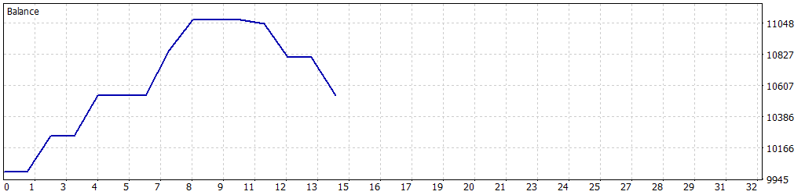

# 📈 Simulación: 01-01-2025 a 31-01-2025

Esta simulación fue realizada para el Expert Advisor **John_Wick_H4** en MetaTrader 5, utilizando datos históricos del par de divisas **AUDCAD** desde el **1 de enero de 2025** hasta el **31 de enero de 2025**. Los parámetros fueron configurados para equilibrar rentabilidad y control de riesgo, utilizando una estrategia basada en Bandas de Bollinger y breakout, con un enfoque conservador que limita el número de posiciones abiertas y aplica una gestión estricta de riesgos mediante stop loss y límites de pérdida diaria.

---

## ⚙️ Configuración de la Simulación

- **Informe del Probador de Estrategias**: FTMO-Server5 (Build 4755)
- **Experto**: John_Wick_H4
- **Símbolo**: AUDCAD
- **Período**: H4 (2025.01.01 - 2025.01.31)
- **Empresa**: FTMO Global Markets Ltd
- **Divisa**: USD
- **Depósito inicial**: 10,000.00 USD
- **Apalancamiento**: 1:30

### Parámetros de Entrada

| Parámetro                   | Descripción                                               | Valor Utilizado   |
|-----------------------------|-----------------------------------------------------------|-------------------|
| `BB_Period`                 | Período de las Bandas de Bollinger                        | 46                |
| `BB_Deviation`              | Desviación de las Bandas de Bollinger                     | 1.8               |
| `LotSize`                   | Tamaño de lote inicial para las operaciones               | 0.8               |
| `MaxContractSize`           | Tamaño máximo de contrato permitido                       | 2.0               |
| `UseComboMultiplier`        | Activar/desactivar multiplicador para rachas ganadoras    | false             |
| `ComboMultiplier`           | Multiplicador para rachas ganadoras                       | 1.6               |
| `SL_Points`                 | Stop Loss en puntos gráficos                              | 550               |
| `UseTrailingStop`           | Activar/desactivar Trailing Stop                         | false             |
| `TrailingStopActivation`    | Puntos de beneficio para activar trailing stop            | 150               |
| `TrailingStopStep`          | Paso en puntos para ajustar el trailing stop              | 180               |
| `MaxPositions`              | Número máximo de posiciones abiertas simultáneamente     | 2                 |
| `CandleSeparation`          | Separación mínima entre velas para nuevas operaciones     | 6                 |
| `UseBreakoutDistance`       | Activar/desactivar distancia de breakout                  | true              |
| `BreakoutDistancePoints`    | Distancia en puntos para breakout                         | 150               |
| `MaxDailyLossFTMO`          | Pérdida diaria máxima permitida (USD)                     | 500.0             |
| `SafetyBeltFactor`          | Multiplicador de seguridad sobre la pérdida máxima diaria | 0.5               |
| `MinOperatingBalance`       | Saldo mínimo operativo (USD)                              | 9050.0            |
| `UseBalanceTarget`          | Activar/desactivar objetivo de saldo                      | false             |
| `BalanceTarget`             | Saldo objetivo para cerrar el bot (USD)                   | 11000.0           |

---

## 📊 Resultados de la Simulación

### Resumen General

| Métrica                          | Valor              |
|----------------------------------|--------------------|
| **Calidad del historial**        | 100%              |
| **Barras**                       | 126               |
| **Ticks**                        | 1,844,651         |
| **Símbolos**                     | 1                 |
| **Beneficio Neto**               | 537.86 USD        |
| **Beneficio Bruto**              | 1,077.35 USD      |
| **Pérdidas Brutas**              | -539.49 USD       |
| **Factor de Beneficio**          | 2.00              |
| **Beneficio Esperado**           | 76.84 USD         |
| **Factor de Recuperación**       | 0.99              |
| **Ratio de Sharpe**              | 0.47              |
| **Z-Score**                      | -1.64 (89.90%)    |
| **AHPR**                         | 1.0078 (0.78%)    |
| **GHPR**                         | 1.0075 (0.75%)    |
| **Reducción absoluta del balance** | 1.20 USD        |
| **Reducción absoluta de la equidad** | 154.16 USD    |
| **Reducción máxima del balance** | 534.69 USD (4.83%) |
| **Reducción máxima de la equidad** | 541.80 USD (4.89%) |
| **Reducción relativa del balance** | 4.83% (534.69 USD) |
| **Reducción relativa de la equidad** | 4.89% (541.80 USD) |
| **Nivel de margen**              | 315.96%           |
| **LR Correlation**               | 0.58              |
| **LR Standard Error**            | 316.12            |
| **Resultado de OnTester**        | 0                 |

### Estadísticas de Operaciones

| Métrica                                   | Valor              |
|-------------------------------------------|--------------------|
| **Total de operaciones ejecutadas**       | 7                 |
| **Total de transacciones**                | 14                |
| **Posiciones rentables (% del total)**    | 4 (57.14%)        |
| **Posiciones no rentables (% del total)** | 3 (42.86%)        |
| **Posiciones cortas (% rentables)**       | 4 (25.00%)        |
| **Posiciones largas (% rentables)**       | 3 (100.00%)       |
| **Transacción rentable promedio**         | 269.34 USD        |
| **Transacción no rentable promedio**      | -177.03 USD       |
| **Transacción rentable máxima**           | 320.38 USD        |
| **Transacción no rentable máxima**        | -269.14 USD       |
| **Máximo de ganancias consecutivas**      | 4 (1,077.35 USD)  |
| **Máximo de pérdidas consecutivas**       | 3 (-531.09 USD)   |
| **Máximo de beneficio consecutivo**       | 1,077.35 USD (4)  |
| **Máximo de pérdidas consecutivas**       | -531.09 USD (3)   |
| **Promedio de ganancias consecutivas**    | 4                 |
| **Promedio de pérdidas consecutivas**     | 3                 |

---

## 📉 Gráfico de Rendimiento

---

## ⚠️ Notas y Advertencia

- Esta simulación utiliza una estrategia basada en Bandas de Bollinger (`BB_Period=46`, `BB_Deviation=1.8`) con una distancia de breakout (`BreakoutDistancePoints=150`) y un máximo de dos posiciones abiertas simultáneamente (`MaxPositions=2`). La desactivación del trailing stop (`UseTrailingStop=false`) y del multiplicador de lotes (`UseComboMultiplier=false`) mantuvo un enfoque conservador en la gestión de riesgos.
- **Advertencia**: Los resultados muestran un beneficio neto moderado de 537.86 USD con un factor de beneficio de 2.00, pero el número limitado de operaciones (7) y el bajo ratio de Sharpe (0.47) sugieren que la estrategia es altamente selectiva y puede no ser consistente en períodos cortos. Los resultados están basados en un período de un mes (01-01-2025 a 31-01-2025), lo que aumenta el riesgo de **sobreoptimización** debido a condiciones específicas del mercado. Se recomienda realizar pruebas en períodos más extensos o en condiciones de mercado en vivo para validar la robustez de la estrategia.
- **Gestión de riesgos**: Ajuste parámetros como `LotSize`, `MaxDailyLossFTMO`, `MinOperatingBalance`, y `SL_Points` según el tamaño de su cuenta y tolerancia al riesgo. La estrategia de breakout puede ser sensible a la volatilidad del par AUDCAD, especialmente en períodos cortos, por lo que es crucial monitorear las condiciones del mercado.