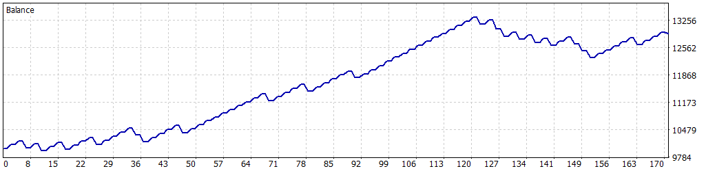

# 🎱 Simulación Optimizada: 01-01-2025 a 06-08-2025

Esta simulación fue realizada para el Expert Advisor **One_Piece_v01** en MetaTrader 5, utilizando datos históricos del símbolo **XAUUSD** desde el **1 de enero de 2025** hasta el **6 de agosto de 2025**. Los parámetros se establecieron para reflejar la configuración por defecto del EA y evaluar su desempeño en condiciones reales de mercado.

---

## 🔙 Configuración de la Simulación

- **Informe del Probador de Estrategias**: FTMO-Server5 (Build 5120)  
- **Experto**: One_Piece_v01  
- **Símbolo**: XAUUSD  
- **Período**: H1 (2025.01.01 – 2025.08.06)  
- **Empresa**: FTMO Global Markets Ltd  
- **Divisa**: USD  
- **Depósito inicial**: 10 000.00 USD  
- **Apalancamiento**: 1:30  

### Parámetros de Entrada

| Parámetro                  | Descripción                                             | Valor Utilizado |
|----------------------------|---------------------------------------------------------|-----------------|
| `LotSize`                  | Tamaño de lote inicial (lotes)                          | 0.06            |
| `SL_Points`                | Stop Loss en puntos gráficos                            | 2860            |
| `TP_Points`                | Take Profit en puntos gráficos                          | 1690            |
| `MaxPositions`             | Máximo de posiciones abiertas simultáneamente           | 1               |
| `UseTrailingStop`          | Activar Trailing Stop                                   | true            |
| `TrailingStopActivation`   | Puntos de ganancia para activar Trailing Stop           | 1500            |
| `TrailingStopStep`         | Paso del Trailing Stop en puntos                        | 800             |
| `ConfirmBreakoutWithClose` | Confirmar ruptura con cierre de vela                    | false           |
| `MaxDailyLossFTMO`         | Pérdida diaria máxima permitida (USD)                   | 500.0           |
| `SafetyBeltFactor`         | Factor de seguridad sobre la pérdida diaria (0.0–1.0)   | 0.95            |
| `MinOperatingBalance`      | Saldo mínimo operativo (USD)                            | 9050.0          |
| `UseBalanceTarget`         | Activar objetivo de balance                             | false           |
| `BalanceTarget`            | Meta de balance para cerrar el bot (USD)                | 11000.0         |

---

## 🎳 Resultados de la Simulación

### Resumen General

| Métrica                              | Valor                       |
|--------------------------------------|-----------------------------|
| **Calidad del historial**            | 99% ticks reales            |
| **Barras**                           | 3507                        |
| **Ticks**                            | 18 957 651                  |
| **Símbolos**                         | 1                           |
| **Beneficio Neto**                   | 2 911.63 USD                |
| **Beneficio Bruto**                  | 6 505.60 USD                |
| **Pérdidas Brutas**                  | -3 593.97 USD               |
| **Factor de Beneficio**              | 1.81                        |
| **Beneficio Esperado**               | 34.25 USD                   |
| **Factor de Recuperación**           | 2.72                        |
| **Ratio de Sharpe**                  | 7.49                        |
| **Z-Score**                          | 0.55 (41.77%)               |
| **AHPR**                             | 1.0031 (0.31%)              |
| **GHPR**                             | 1.0030 (0.30%)              |
| **Reducción absoluta del balance**     | 46.57 USD                 |
| **Reducción absoluta de la equidad**   | 90.49 USD                 |
| **Reducción máxima del balance**       | 1 029.02 USD (7.72%)      |
| **Reducción máxima de la equidad**     | 1 069.60 USD (8.00%)      |
| **Reducción relativa del balance**     | 7.72% (1 029.02 USD)      |
| **Reducción relativa de la equidad**   | 8.00% (1 069.60 USD)      |
| **Nivel de margen**                  | 510.67%                     |
| **LR Correlation**                   | 0.94                        |
| **LR Standard Error**                | 384.98                      |
| **Resultado de OnTester**            | 0                           |

### Estadísticas de Operaciones

| Métrica                                    | Valor               |
|--------------------------------------------|---------------------|
| **Total de operaciones ejecutadas**        | 85                  |
| **Total de transacciones**                 | 170                 |
| **Posiciones rentables (% del total)**     | 64 (75.29%)         |
| **Posiciones no rentables (% del total)**  | 21 (24.71%)         |
| **Posiciones cortas (% rentables)**        | 38 (76.32%)         |
| **Posiciones largas (% rentables)**        | 47 (74.47%)         |
| **Transacción rentable promedio**          | 101.65 USD          |
| **Transacción no rentable promedio**       | -170.76 USD         |
| **Transacción rentable máxima**            | 119.18 USD          |
| **Transacción no rentable máxima**         | -223.71 USD         |
| **Máximo de ganancias consecutivas**       | 15 (1 536.91 USD)   |
| **Máximo de pérdidas consecutivas**        | 3 (-527.51 USD)     |
| **Promedio de ganancias consecutivas**     | 4                   |
| **Promedio de pérdidas consecutivas**      | 1                   |

---

## 🎲 Gráfico de Rendimiento

---

## 🔍 Notas y Advertencia

- Esta simulación utiliza la configuración por defecto del EA **One_Piece_v01**, sin optimización adicional de parámetros.  
- La calidad de datos es del 99% de ticks reales, por lo que puede haber ligeras variaciones en los resultados.  
- **Advertencia**: Resultados pasados no garantizan rendimiento futuro. Se recomienda probar en cuenta demo y en otros períodos para validar la robustez de la estrategia.
