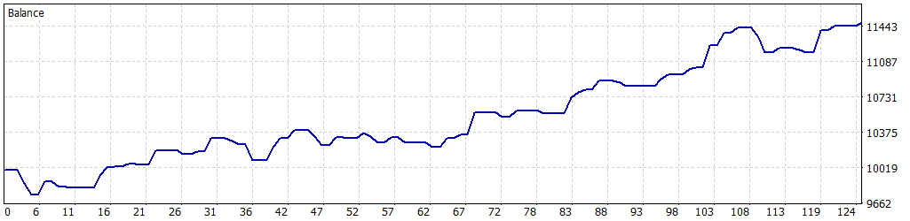

# 📈 Simulación Optimizada: 01-01-2025 a 30-04-2025

Esta simulación fue realizada para el Expert Advisor **Pirañas** en MetaTrader 5, utilizando datos históricos del par **EURUSD** desde el **1 de enero de 2025** hasta el **30 de abril de 2025**. Los parámetros fueron optimizados para maximizar el rendimiento mientras se controla el riesgo, logrando un equilibrio entre rentabilidad y estabilidad.

---

## ⚙️ Configuración de la Simulación

- **Informe del Probador de Estrategias**: FTMO-Server5 (Build 4755)
- **Experto**: Pirañas
- **Símbolo**: EURUSD
- **Período**: H1 (2025.01.01 - 2025.04.30)
- **Empresa**: FTMO Global Markets Ltd
- **Divisa**: USD
- **Depósito inicial**: 10,000.00 USD
- **Apalancamiento**: 1:30

### Parámetros de Entrada

| Parámetro                   | Descripción                                               | Valor Utilizado   |
|-----------------------------|-----------------------------------------------------------|-------------------|
| `PERIODO`                   | Marco temporal del gráfico                                | H1                |
| `RSI_PERIODO`               | Períodos del RSI                                          | 4                 |
| `RSI_NIVEL_COMPRA`          | Nivel de RSI para compras (sobreventa)                    | 35                |
| `RSI_NIVEL_VENTA`           | Nivel de RSI para ventas (sobrecompra)                    | 65                |
| `MA_PERIODO`                | Períodos de la EMA                                        | 200               |
| `ADX_PERIODO`               | Períodos del ADX                                          | 18                |
| `ADX_NIVEL_MAX`             | Nivel máximo de ADX (mercado en rango)                    | 30.0              |
| `LOTAJE_INICIAL`            | Tamaño de lote inicial                                    | 0.1               |
| `MULTIPLICADOR`             | Multiplicador de lotes para martingala                    | 1.5               |
| `OBJETIVO_PROFIT`           | Beneficio objetivo para cerrar posiciones (USD)           | 220.0             |
| `DISTANCIA_OPERACIONES`     | Distancia mínima entre operaciones (puntos)               | 105               |
| `MaxDailyLossFTMO`          | Pérdida diaria máxima permitida (USD)                     | 500.0             |
| `SafetyBeltFactor`          | Factor de seguridad para pérdida diaria (0.0 a 1.0)       | 0.5               |
| `InitialBalance`            | Balance inicial de referencia (USD)                       | 10000.0           |
| `MinOperatingBalance`       | Capital mínimo para operar (USD)                          | 9100.0            |
| `UseBalanceTarget`          | Activar objetivo de balance                               | false             |
| `BalanceTarget`             | Objetivo de balance para cerrar el bot (USD)              | 11000.0           |
| `DiasCierreBeneficio`       | Días mínimos para cerrar con beneficio                    | 0                 |
| `BeneficioMinimoCierre`     | Beneficio mínimo para cierre por tiempo (USD)             | 438.0             |
| `DiasTopeMaximo`            | Días máximos para cerrar posiciones                       | 2                 |

---

## 📊 Resultados de la Simulación

### Resumen General

| Métrica                          | Valor              |
|----------------------------------|--------------------|
| **Calidad del historial**        | 100% (ticks reales) |
| **Barras**                       | 2,016             |
| **Ticks**                        | 6,221,211         |
| **Símbolos**                     | 1                 |
| **Beneficio Neto**               | 1,483.50 USD      |
| **Beneficio Bruto**              | 2,856.10 USD      |
| **Pérdidas Brutas**              | -1,372.60 USD     |
| **Factor de Beneficio**          | 2.08              |
| **Beneficio Esperado**           | 23.93 USD         |
| **Factor de Recuperación**       | 3.68              |
| **Ratio de Sharpe**              | 4.31              |
| **Z-Score**                      | -0.71 (52.23%)    |
| **AHPR**                         | 1.0023 (0.23%)    |
| **GHPR**                         | 1.0022 (0.22%)    |
| **Reducción absoluta del balance** | 250.86 USD      |
| **Reducción absoluta de la equidad** | 327.10 USD    |
| **Reducción máxima del balance** | 251.51 USD (2.20%) |
| **Reducción máxima de la equidad** | 402.74 USD (3.49%) |
| **Reducción relativa del balance** | 2.51% (250.86 USD) |
| **Reducción relativa de la equidad** | 3.49% (402.74 USD) |
| **Nivel de margen**              | 591.72%           |
| **LR Correlation**               | 0.96              |
| **LR Standard Error**            | 134.34            |
| **Resultado de OnTester**        | 0                 |

### Estadísticas de Operaciones

| Métrica                                   | Valor              |
|-------------------------------------------|--------------------|
| **Total de operaciones ejecutadas**       | 62                |
| **Total de transacciones**                | 124               |
| **Posiciones rentables (% del total)**    | 36 (58.06%)       |
| **Posiciones no rentables (% del total)** | 26 (41.94%)       |
| **Posiciones cortas (% rentables)**       | 33 (60.61%)       |
| **Posiciones largas (% rentables)**       | 29 (55.17%)       |
| **Transacción rentable promedio**         | 79.34 USD         |
| **Transacción no rentable promedio**      | -52.36 USD        |
| **Transacción rentable máxima**           | 223.37 USD        |
| **Transacción no rentable máxima**        | -156.79 USD       |
| **Máximo de ganancias consecutivas**      | 7 (589.51 USD)    |
| **Máximo de pérdidas consecutivas**       | 3 (-224.12 USD)   |
| **Máximo de beneficio consecutivo**       | 589.51 USD (7)    |
| **Máximo de pérdidas consecutivas**       | -250.98 USD (2)   |
| **Promedio de ganancias consecutivas**    | 3                 |
| **Promedio de pérdidas consecutivas**     | 2                 |

---

## 📉 Gráfico de Rendimiento

---

## ⚠️ Notas y Advertencia

- Esta simulación se realizó con datos históricos de alta calidad (100% ticks reales) para el período de cuatro meses (01-01-2025 a 30-04-2025).
- **Advertencia**: Los resultados reflejan un período corto de prueba, lo que podría limitar la representatividad de las condiciones futuras del mercado. La estrategia de **Pirañas**, basada en reversión al rango con martingala conservadora, puede ser sensible a cambios en la volatilidad o tendencias fuertes. Se recomienda realizar pruebas adicionales en períodos más amplios o en condiciones de mercado en vivo para validar la robustez de la estrategia.
- **Gestión de riesgos**: Los parámetros como `MaxDailyLossFTMO` y `SafetyBeltFactor` están diseñados para cumplir con las reglas de FTMO, asegurando una operativa segura. Sin embargo, el uso de martingala requiere una monitorización cuidadosa.
- **Recomendaciones**:
  - Prueba el EA en una cuenta demo antes de operarlo en vivo.
  - Evita operar durante noticias de alto impacto (e.g., NFP, decisiones del BCE), ya que el EA no incluye un filtro automático de noticias.
  - Considera optimizar los parámetros para otros pares o temporalidades si planeas usar el EA fuera de EURUSD en H1.