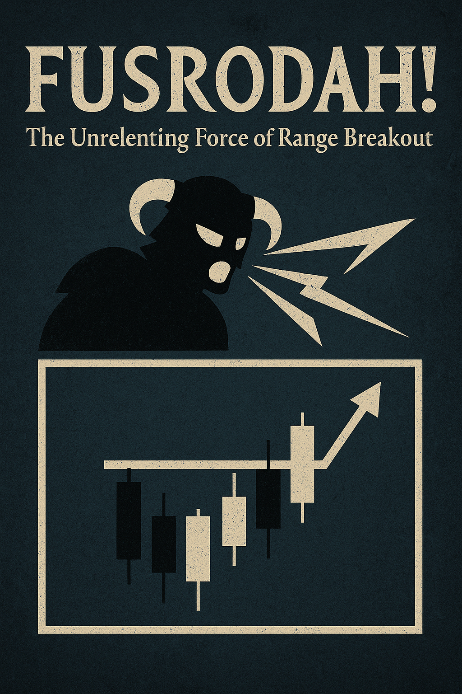

# Trading_Bots 🤖

Bots de trading automatizados en MQL5 para MetaTrader 5 (MT5). Contiene expertos asesores (EAs) y herramientas enfocadas en estrategias de trading algorítmico para mercados financieros.

---

## Bots Disponibles

<table style="table-layout:fixed; width:100%;">
  <tr>
    <th style="text-align:center; width:180px; min-width:180px; max-width:180px;">Bot</th>
    <th style="text-align:center; width:180px; min-width:180px; max-width:180px;">Nombre</th>
    <th style="text-align:center; width:500px; min-width:500px;">Descripción</th>
  </tr>
  <tr>
    <td style="text-align:center"></td>
    <td style="text-align:center"><a href="Tokyo_Breakers/README.md"><b>Tokyo_Breakers</b></a></td>
    <td style="text-align:center">Expert Advisor para MetaTrader 5 que opera en USDJPY diseñado para ejecutar operaciones automáticas basadas en <b>rupturas de Bandas de Bollinger</b>.</td>
  </tr>
  <tr>
    <td style="text-align:center"></td>
    <td style="text-align:center"><a href="FusRoDah!/README.md"><b>FusRoDah!</b></a></td>
    <td style="text-align:center">Expert Advisor para MetaTrader 5 que opera en USDJPY diseñado para ejecutar operaciones automáticas basadas en <b>rupturas de niveles de soporte y resistencia</b>.</td>
  </tr>
</table>

---

## Cómo Usar Este Repositorio
1. Cada bot está en su propio subdirectorio con un `README.md` detallado.
2. Haz clic en el nombre del bot para ver su documentación completa.
3. Asegúrate de tener MetaTrader 5 y el MetaEditor para compilar los archivos `.mq5`.

## Notas
- Este es un repositorio privado para desarrollo interno.
- Cada bot incluye su propia licencia en su subdirectorio.