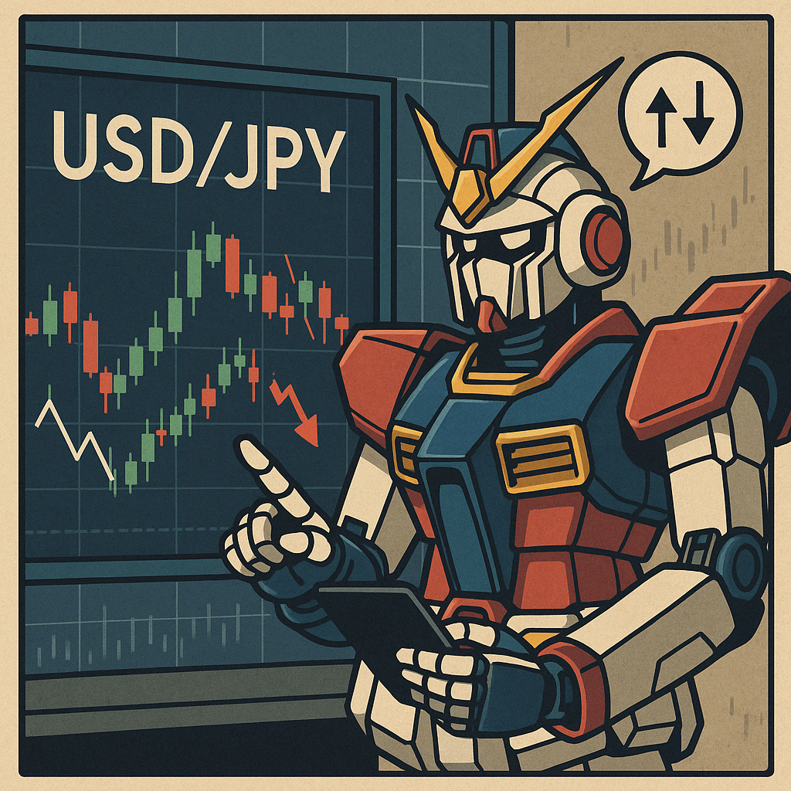
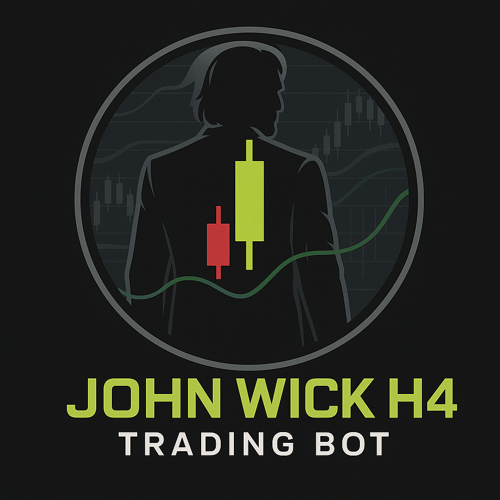
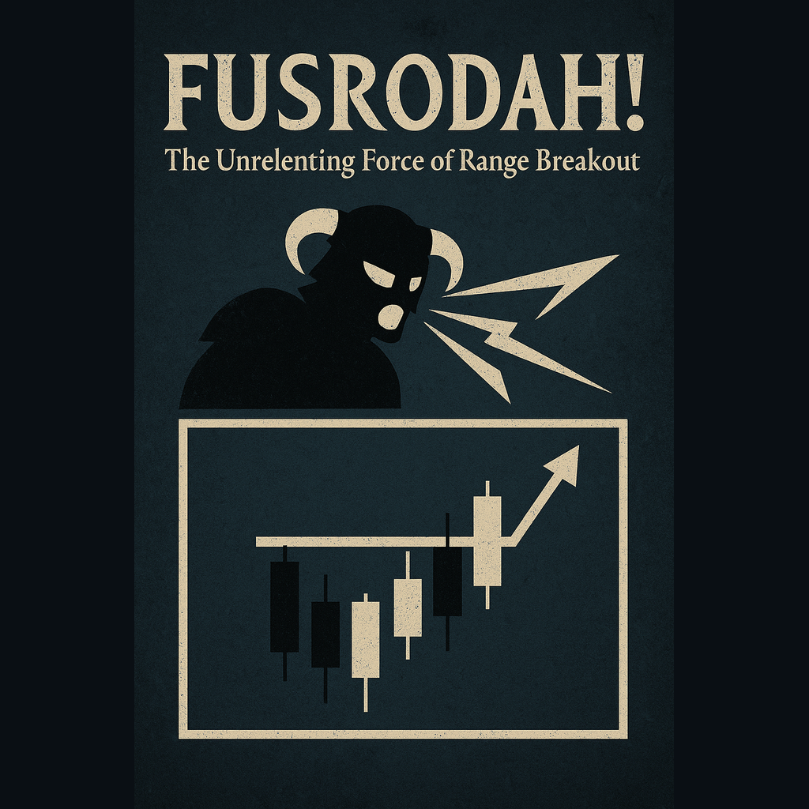
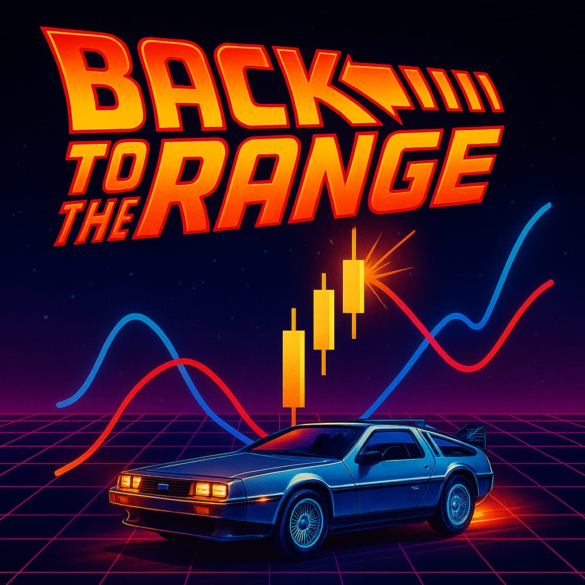
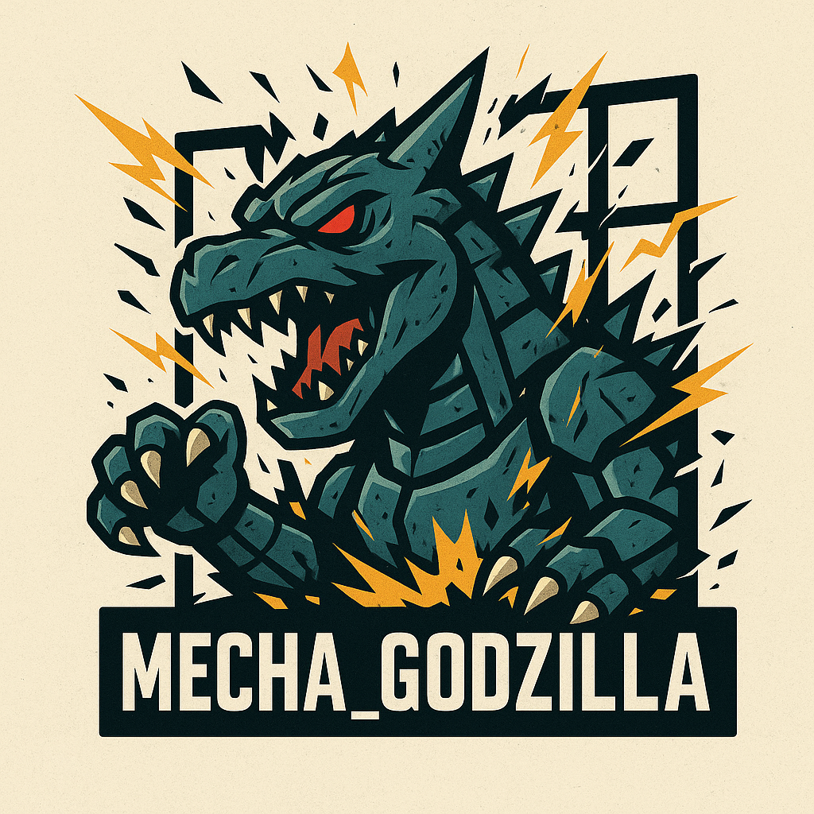

# Trading_Bots 🤖

Bots de trading automatizados en MQL5 para MetaTrader 5 (MT5). Contiene expertos asesores (EAs) y herramientas enfocadas en estrategias de trading algorítmico para mercados financieros.

---

## Bots Disponibles

<table style="table-layout:fixed; width:100%;">
  <tr>
    <th style="text-align:center; width:220px; min-width:220px; max-width:220px;">Bot</th>
    <th style="text-align:center;">Descripción</th>
  </tr>
  <tr>
    <td colspan="2" style="text-align:center; background-color:#f0f0f0; padding:10px;"><b>Bandas de Bollinger</b></td>
  </tr>
  <tr>
    <td style="text-align:center"></td>
    <td style="text-align:left"><a href="Tokyo_Breakers/README.md"><b>Tokyo_Breakers</b></a></td>
  </tr>
  <tr>
    <td style="text-align:center"></td>
    <td style="text-align:left"><a href="John_Wick_H4/README.md"><b>John_Wick_H4</b></a></td>
  </tr>
  <tr>
    <td colspan="2" style="text-align:center; background-color:#f0f0f0; padding:10px;"><b>Estrategias de Rango</b></td>
  </tr>
  <tr>
    <td style="text-align:center"></td>
    <td style="text-align:left"><a href="FusRoDah!/README.md"><b>FusRoDah!</b></a></td>
  </tr>
  <tr>
    <td style="text-align:center"></td>
    <td style="text-align:left"><a href="Back_to_the_Range/README.md"><b>Back to the Range</b></a></td>
  </tr>
  <tr>
    <td colspan="2" style="text-align:center; background-color:#f0f0f0; padding:10px;"><b>Reversión</b></td>
  </tr>
  <tr>
    <td style="text-align:center"></td>
    <td style="text-align:left"><a href="Pirañas/README.md"><b>Pirañas</b></a></td>
  </tr>
  <tr>
    <td colspan="2" style="text-align:center; background-color:#f0f0f0; padding:10px;"><b>Grid Trading</b></td>
  </tr>
  <tr>
    <td style="text-align:center"></td>
    <td style="text-align:left"><a href="Mecha_Godzilla/README.md"><b>Mecha-Godzilla</b></a></td>
  </tr>
</table>

---

## Cómo Usar Este Repositorio
1. Cada bot está en su propio subdirectorio con un `README.md` detallado.
2. Haz clic en el nombre del bot para ver su documentación completa.
3. Asegúrate de tener MetaTrader 5 y el MetaEditor para compilar los archivos `.mq5`.

## Notas
- Este es un repositorio privado para desarrollo interno.
- Cada bot incluye su propia licencia en su subdirectorio.