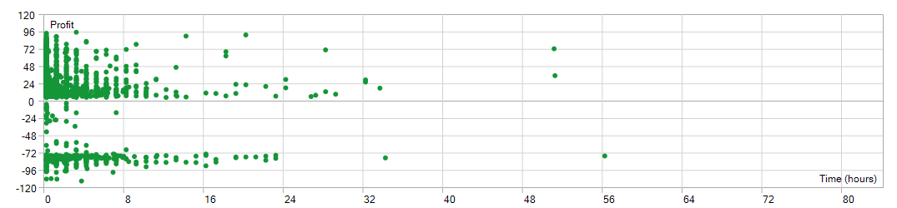
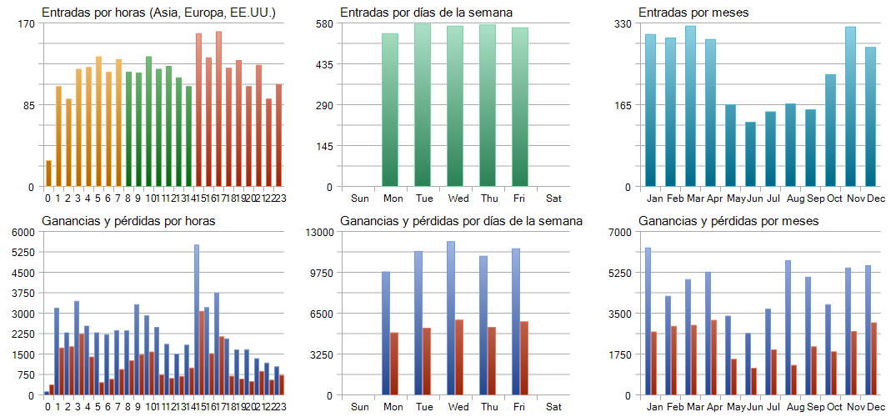

# 📊 Simulaciones y Optimizaciones de Tokyo_Breakers

Esta carpeta contiene los resultados de las simulaciones y optimizaciones realizadas para el Expert Advisor **Tokyo_Breakers** en MetaTrader 5. Aquí encontrarás los reportes generados, incluyendo estadísticas detalladas y gráficos de rendimiento.

## Reporte de Simulación

- **Reporte Completo (HTML)**: [Ver Reporte de Simulación](ReportTester-550097663.html)  
  Haz clic en el enlace para abrir el reporte detallado de la simulación en tu navegador.

## Gráficos de Rendimiento

A continuación, se muestran los gráficos generados durante la simulación:

- **Gráfico General**  
  

- **Posiciones Abiertas (Holding)**  
  

- **Histograma (HST)**  
  

- **MF MAME**  
  

## Notas
- Los archivos HTML y las imágenes fueron generados automáticamente por MetaTrader 5 durante las pruebas de backtesting.
- Asegúrate de tener los archivos en esta carpeta para que los enlaces funcionen correctamente.