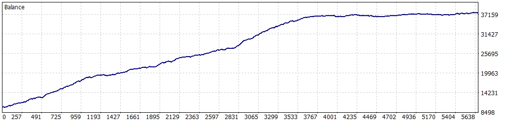

# ?? Simulaci車n Optimizada: 01-01-2023 a 30-04-2025

Esta simulaci車n fue realizada para el Expert Advisor **Tokyo_Breakers** en MetaTrader 5, utilizando datos hist車ricos del par **USDJPY** desde el **1 de enero de 2023** hasta el **30 de abril de 2025**. Los par芍metros fueron optimizados para maximizar el rendimiento mientras se controla el riesgo, logrando un equilibrio entre rentabilidad y estabilidad.

---

## ?? Configuraci車n de la Simulaci車n

- **Informe del Probador de Estrategias**: FTMO-Server5 (Build 4755)
- **Experto**: Tokyo_Breakers
- **S赤mbolo**: USDJPY
- **Per赤odo**: H1 (2023.01.01 - 2025.04.30)
- **Empresa**: FTMO Global Markets Ltd
- **Divisa**: USD
- **Dep車sito inicial**: 10,000.00 USD
- **Apalancamiento**: 1:30

### Par芍metros de Entrada

| Par芍metro                   | Descripci車n                                               | Valor Utilizado   |
|-----------------------------|-----------------------------------------------------------|-------------------|
| `BB_Period`                 | Periodo de las Bandas de Bollinger                        | 14                |
| `BB_Deviation`              | Desviaci車n est芍ndar para las bandas                       | 1.0               |
| `LotSize`                   | Tama?o de lote inicial                                    | 0.3               |
| `SL_Points`                 | Stop Loss en puntos                                       | 390               |
| `TP_Points`                 | Take Profit en puntos                                     | 350               |
| `UseTrailingStop`           | Activar/desactivar trailing stop                          | true              |
| `TrailingStopActivation`    | Beneficio necesario para activar trailing stop            | 50                |
| `TrailingStopStep`          | Paso del trailing stop en puntos                          | 15                |
| `MaxPositions`              | M芍ximo de operaciones abiertas por direcci車n              | 2                 |
| `CandleSeparation`          | Velas m赤nimas entre operaciones nuevas                    | 2                 |
| `UseBalanceTarget`          | Activar objetivo de balance                               | false             |
| `BalanceTarget`             | Objetivo de balance para cerrar el bot                    | 11000.0           |
| `MinOperatingBalance`       | Balance m赤nimo para operar                                | 9050.0            |
| `MaxDailyLossFTMO`          | P谷rdida diaria m芍xima permitida                           | 500.0             |
| `SafetyBeltFactor`          | Multiplicador de seguridad sobre la p谷rdida m芍xima diaria | 0.3               |
| `UseComboMultiplier`        | Activar multiplicador de lotes tras ganancia              | false             |
| `ComboMultiplier`           | Multiplicador en rachas ganadoras                         | 2.0               |
| `MaxContractSize`           | Tama?o m芍ximo de lote                                     | 2.0               |
| `UseBreakoutDistance`       | Activar ruptura en la vela actual                         | true              |
| `BreakoutDistancePoints`    | Distancia m赤nima para confirmar la ruptura                | 250               |

---

## ?? Resultados de la Simulaci車n

### Resumen General

| M谷trica                          | Valor              |
|----------------------------------|--------------------|
| **Calidad del historial**        | 23%               |
| **Barras**                       | 9,673             |
| **Ticks**                        | 34,809,890        |
| **S赤mbolos**                     | 1                 |
| **Beneficio Neto**               | 27,367.49 USD     |
| **Beneficio Bruto**              | 56,088.22 USD     |
| **P谷rdidas Brutas**              | -28,720.73 USD    |
| **Factor de Beneficio**          | 1.95              |
| **Beneficio Esperado**           | 9.69 USD          |
| **Factor de Recuperaci車n**       | 34.57             |
| **Ratio de Sharpe**              | 13.79             |
| **Z-Score**                      | -2.94 (99.67%)    |
| **AHPR**                         | 1.0005 (0.05%)    |
| **GHPR**                         | 1.0005 (0.05%)    |
| **Reducci車n absoluta del balance** | 105.94 USD      |
| **Reducci車n absoluta de la equidad** | 100.43 USD    |
| **Reducci車n m芍xima del balance** | 783.92 USD (2.11%) |
| **Reducci車n m芍xima de la equidad** | 791.55 USD (2.13%) |
| **Reducci車n relativa del balance** | 2.66% (344.73 USD) |
| **Reducci車n relativa de la equidad** | 2.74% (355.74 USD) |
| **Nivel de margen**              | 249.36%           |
| **LR Correlation**               | 0.97              |
| **LR Standard Error**            | 2,300.60          |
| **Resultado de OnTester**        | 0                 |

### Estad赤sticas de Operaciones

| M谷trica                                   | Valor              |
|-------------------------------------------|--------------------|
| **Total de operaciones ejecutadas**       | 2,825             |
| **Total de transacciones**                | 5,650             |
| **Posiciones rentables (% del total)**    | 2,465 (87.26%)    |
| **Posiciones no rentables (% del total)** | 360 (12.74%)      |
| **Posiciones cortas (% rentables)**       | 1,324 (87.24%)    |
| **Posiciones largas (% rentables)**       | 1,501 (87.28%)    |
| **Transacci車n rentable promedio**         | 22.75 USD         |
| **Transacci車n no rentable promedio**      | -76.25 USD        |
| **Transacci車n rentable m芍xima**           | 95.20 USD         |
| **Transacci車n no rentable m芍xima**        | -111.19 USD       |
| **M芍ximo de ganancias consecutivas**      | 41 (846.91 USD)   |
| **M芍ximo de p谷rdidas consecutivas**       | 4 (-264.87 USD)   |
| **M芍ximo de beneficio consecutivo**       | 1,349.36 USD (35) |
| **M芍ximo de p谷rdidas consecutivas**       | -264.87 USD (4)   |
| **Promedio de ganancias consecutivas**    | 8                 |
| **Promedio de p谷rdidas consecutivas**     | 1                 |

---

## ?? Gr芍fico de Rendimiento

---

## ?? Notas y Advertencia

- Esta simulaci車n se realiz車 despu谷s de un proceso de optimizaci車n de par芍metros.
- **Advertencia**: Aunque la optimizaci車n mejora el rendimiento, al estar concentrada en un per赤odo de apenas dos a?os y medio (01-01-2023 a 30-04-2025), puede haber cierta **sobreoptimizaci車n**. Esto significa que los resultados podr赤an no ser completamente representativos de condiciones futuras del mercado. Se recomienda realizar pruebas adicionales en per赤odos m芍s amplios o en condiciones de mercado en vivo para validar la robustez de la estrategia.
- Aseg迆rate de que el archivo de la imagen est谷 en esta carpeta para que se muestre correctamente.