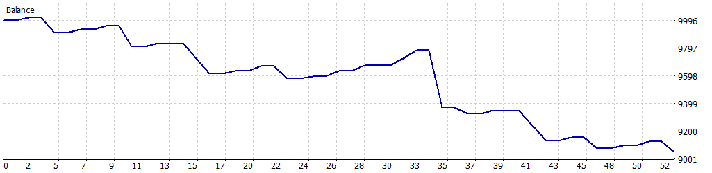

# 🎱 Simulación Optimizada: 01-01-2025 a 31-01-2025

Esta simulación fue realizada para el Expert Advisor **Tokyo_Breakers** en MetaTrader 5, utilizando datos históricos del par **USDJPY** desde el **1 de enero de 2025** hasta el **31 de enero de 2025**. Los parámetros fueron optimizados para maximizar el rendimiento mientras se controla el riesgo, logrando un equilibrio entre rentabilidad y estabilidad.

---

## 🔙 Configuración de la Simulación

- **Informe del Probador de Estrategias**: FTMO-Server5 (Build 4755)
- **Experto**: Tokyo_Breakers
- **Símbolo**: USDJPY
- **Período**: H1 (2025.01.01 - 2025.01.31)
- **Empresa**: FTMO Global Markets Ltd
- **Divisa**: USD
- **Depósito inicial**: 10,000.00 USD
- **Apalancamiento**: 1:30

### Parámetros de Entrada

| Parámetro                   | Descripción                                               | Valor Utilizado   |
|-----------------------------|-----------------------------------------------------------|-------------------|
| `BB_Period`                 | Periodo de las Bandas de Bollinger                        | 14                |
| `BB_Deviation`              | Desviación estándar para las bandas                       | 1.0               |
| `LotSize`                   | Tamaño de lote inicial                                    | 0.3               |
| `SL_Points`                 | Stop Loss en puntos                                       | 390               |
| `TP_Points`                 | Take Profit en puntos                                     | 350               |
| `UseTrailingStop`           | Activar/desactivar trailing stop                          | true              |
| `TrailingStopActivation`    | Beneficio necesario para activar trailing stop            | 110               |
| `TrailingStopStep`          | Paso del trailing stop en puntos                          | 10                |
| `MaxPositions`              | Máximo de operaciones abiertas por dirección              | 3                 |
| `CandleSeparation`          | Velas mínimas entre operaciones nuevas                    | 2                 |
| `UseComboMultiplier`        | Activar multiplicador de lotes tras ganancia              | true              |
| `ComboMultiplier`           | Multiplicador en rachas ganadoras                         | 1.4               |
| `MaxContractSize`           | Tamaño máximo de lote                                     | 2.0               |
| `UseBreakoutDistance`       | Activar ruptura en la vela actual                         | true              |
| `BreakoutDistancePoints`    | Distancia mínima para confirmar la ruptura                | 250               |
| `MaxDailyLossFTMO`          | Pérdida diaria máxima permitida                           | 500.0             |
| `SafetyBeltFactor`          | Multiplicador de seguridad sobre la pérdida máxima diaria | 0.5               |
| `UseBalanceTarget`          | Activar objetivo de balance                               | false             |
| `BalanceTarget`             | Objetivo de balance para cerrar el bot                    | 11000.0           |
| `MinOperatingBalance`       | Balance mínimo para operar                                | 9050.0            |

---

## 🎳 Resultados de la Simulación

### Resumen General

| Métrica                          | Valor              |
|----------------------------------|--------------------|
| **Calidad del historial**        | 100%              |
| **Barras**                       | 504               |
| **Ticks**                        | 1,961,797         |
| **Símbolos**                     | 1                 |
| **Beneficio Neto**               | -950.92 USD       |
| **Beneficio Bruto**              | 452.17 USD        |
| **Pérdidas Brutas**              | -1,403.09 USD     |
| **Factor de Beneficio**          | 0.32              |
| **Beneficio Esperado**           | -36.57 USD        |
| **Factor de Recuperación**       | -0.98             |
| **Ratio de Sharpe**              | -5.00             |
| **Z-Score**                      | 1.15 (74.57%)     |
| **AHPR**                         | 0.9962 (-0.38%)   |
| **GHPR**                         | 0.9962 (-0.38%)   |
| **Reducción absoluta del balance** | 950.92 USD      |
| **Reducción absoluta de la equidad** | 950.92 USD    |
| **Reducción máxima del balance** | 969.61 USD (9.68%) |
| **Reducción máxima de la equidad** | 971.96 USD (9.70%) |
| **Reducción relativa del balance** | 9.68% (969.61 USD) |
| **Reducción relativa de la equidad** | 9.70% (971.96 USD) |
| **Nivel de margen**              | 170.58%           |
| **LR Correlation**               | -0.94             |
| **LR Standard Error**            | 106.74            |
| **Resultado de OnTester**        | 0                 |

### Estadísticas de Operaciones

| Métrica                                   | Valor              |
|-------------------------------------------|--------------------|
| **Total de operaciones ejecutadas**       | 26                |
| **Total de transacciones**                | 52                |
| **Posiciones rentables (% del total)**    | 15 (57.69%)       |
| **Posiciones no rentables (% del total)** | 11 (42.31%)       |
| **Posiciones cortas (% rentables)**       | 8 (62.50%)        |
| **Posiciones largas (% rentables)**       | 18 (55.56%)       |
| **Transacción rentable promedio**         | 30.14 USD         |
| **Transacción no rentable promedio**      | -125.84 USD       |
| **Transacción rentable máxima**           | 58.15 USD         |
| **Transacción no rentable máxima**        | -410.74 USD       |
| **Máximo de ganancias consecutivas**      | 5 (209.87 USD)    |
| **Máximo de pérdidas consecutivas**       | 2 (-453.12 USD)   |
| **Máximo de beneficio consecutivo**       | 209.87 USD (5)    |
| **Máximo de pérdidas consecutivas**       | -453.12 USD (2)   |
| **Promedio de ganancias consecutivas**    | 2                 |
| **Promedio de pérdidas consecutivas**     | 1                 |

---

## 🎲 Gráfico de Rendimiento

---

## 🔍 Notas y Advertencia

- Esta simulación se realizó después de un proceso de optimización de parámetros (`TrailingStopActivation`, `TrailingStopStep`, `ComboMultiplier`), con `UseComboMultiplier` activado para esta simulación.
- **Advertencia**: Aunque la optimización mejora el rendimiento, al estar concentrada en un período de 1 mes (01-01-2025 a 31-01-2025), puede haber cierta **sobreoptimización**. Esto significa que los resultados podrían no ser completamente representativos de condiciones futuras del mercado. Se recomienda realizar pruebas adicionales en períodos más amplios o en condiciones de mercado en vivo para validar la robustez de la estrategia.