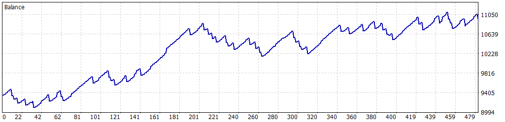

# 🎱 Simulación Optimizada: 01-01-2025 a 01-05-2025

Esta simulación fue realizada para el Expert Advisor **Tokyo_Breakers** en MetaTrader 5, utilizando datos históricos del par **USDJPY** desde el **1 de enero de 2025** hasta el **1 de mayo de 2025**. Los parámetros fueron optimizados para maximizar el rendimiento mientras se controla el riesgo, logrando un equilibrio entre rentabilidad y estabilidad.

---

## 🔙 Configuración de la Simulación

- **Informe del Probador de Estrategias**: FTMO-Server5 (Build 4755)
- **Experto**: Tokyo_Breakers
- **Símbolo**: USDJPY
- **Período**: H1 (2025.01.01 - 2025.05.01)
- **Empresa**: FTMO Global Markets Ltd
- **Divisa**: USD
- **Depósito inicial**: 9,346.68 USD
- **Apalancamiento**: 1:30

### Parámetros de Entrada

| Parámetro                   | Descripción                                               | Valor Utilizado   |
|-----------------------------|-----------------------------------------------------------|-------------------|
| `BB_Period`                 | Periodo de las Bandas de Bollinger                        | 14                |
| `BB_Deviation`              | Desviación estándar para las bandas                       | 1.0               |
| `LotSize`                   | Tamaño de lote inicial                                    | 0.3               |
| `SL_Points`                 | Stop Loss en puntos                                       | 390               |
| `TP_Points`                 | Take Profit en puntos                                     | 350               |
| `UseTrailingStop`           | Activar/desactivar trailing stop                          | true              |
| `TrailingStopActivation`    | Beneficio necesario para activar trailing stop            | 110               |
| `TrailingStopStep`          | Paso del trailing stop en puntos                          | 10                |
| `MaxPositions`              | Máximo de operaciones abiertas por dirección              | 2                 |
| `CandleSeparation`          | Velas mínimas entre operaciones nuevas                    | 8                 |
| `UseComboMultiplier`        | Activar multiplicador de lotes tras ganancia              | true              |
| `ComboMultiplier`           | Multiplicador en rachas ganadoras                         | 1.4               |
| `MaxContractSize`           | Tamaño máximo de lote                                     | 0.5               |
| `UseBreakoutDistance`       | Activar ruptura en la vela actual                         | true              |
| `BreakoutDistancePoints`    | Distancia mínima para confirmar la ruptura                | 250               |
| `MaxDailyLossFTMO`          | Pérdida diaria máxima permitida                           | 500.0             |
| `SafetyBeltFactor`          | Multiplicador de seguridad sobre la pérdida máxima diaria | 0.5               |
| `UseBalanceTarget`          | Activar objetivo de balance                               | false             |
| `BalanceTarget`             | Objetivo de balance para cerrar el bot                    | 11000.0           |
| `MinOperatingBalance`       | Balance mínimo para operar                                | 9050.0            |

---

## 🎳 Resultados de la Simulación

### Resumen General

| Métrica                          | Valor              |
|----------------------------------|--------------------|
| **Calidad del historial**        | 100%              |
| **Barras**                       | 2,040             |
| **Ticks**                        | 8,439,911         |
| **Símbolos**                     | 1                 |
| **Beneficio Neto**               | 1,565.44 USD      |
| **Beneficio Bruto**              | 7,263.38 USD      |
| **Pérdidas Brutas**              | -5,697.94 USD     |
| **Factor de Beneficio**          | 1.27              |
| **Beneficio Esperado**           | 6.52 USD          |
| **Factor de Recuperación**       | 2.12              |
| **Ratio de Sharpe**              | 5.59              |
| **Z-Score**                      | -0.43 (33.28%)    |
| **AHPR**                         | 1.0007 (0.07%)    |
| **GHPR**                         | 1.0006 (0.06%)    |
| **Reducción absoluta del balance** | 252.43 USD      |
| **Reducción absoluta de la equidad** | 259.26 USD    |
| **Reducción máxima del balance** | 684.87 USD (6.31%) |
| **Reducción máxima de la equidad** | 738.09 USD (6.80%) |
| **Reducción relativa del balance** | 6.31% (684.87 USD) |
| **Reducción relativa de la equidad** | 6.80% (738.09 USD) |
| **Nivel de margen**              | 273.01%           |
| **LR Correlation**               | 0.90              |
| **LR Standard Error**            | 243.78            |
| **Resultado de OnTester**        | 0                 |

### Estadísticas de Operaciones

| Métrica                                   | Valor              |
|-------------------------------------------|--------------------|
| **Total de operaciones ejecutadas**       | 240               |
| **Total de transacciones**                | 480               |
| **Posiciones rentables (% del total)**    | 193 (80.42%)      |
| **Posiciones no rentables (% del total)** | 47 (19.58%)       |
| **Posiciones cortas (% rentables)**       | 125 (84.80%)      |
| **Posiciones largas (% rentables)**       | 115 (75.65%)      |
| **Transacción rentable promedio**         | 37.63 USD         |
| **Transacción no rentable promedio**      | -117.78 USD       |
| **Transacción rentable máxima**           | 114.58 USD        |
| **Transacción no rentable máxima**        | -155.67 USD       |
| **Máximo de ganancias consecutivas**      | 24 (998.23 USD)   |
| **Máximo de pérdidas consecutivas**       | 3 (-337.72 USD)   |
| **Máximo de beneficio consecutivo**       | 998.23 USD (24)   |
| **Máximo de pérdidas consecutivas**       | -337.72 USD (3)   |
| **Promedio de ganancias consecutivas**    | 5                 |
| **Promedio de pérdidas consecutivas**     | 1                 |

---

## 🎲 Gráfico de Rendimiento

---

## 🔍 Notas y Advertencia

- Esta simulación se realizó después de un proceso de optimización de parámetros (`TrailingStopActivation`, `TrailingStopStep`, `ComboMultiplier`), con `UseComboMultiplier` activado para esta simulación.
- **Advertencia**: Aunque la optimización mejora el rendimiento, al estar concentrada en un período de 4 meses (01-01-2025 a 01-05-2025), puede haber cierta **sobreoptimización**. Esto significa que los resultados podrían no ser completamente representativos de condiciones futuras del mercado. Se recomienda realizar pruebas adicionales en períodos más amplios o en condiciones de mercado en vivo para validar la robustez de la estrategia.